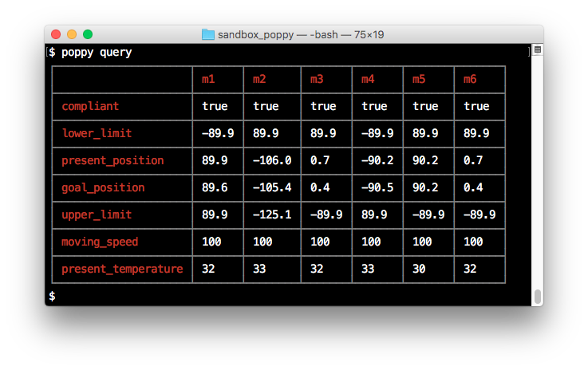
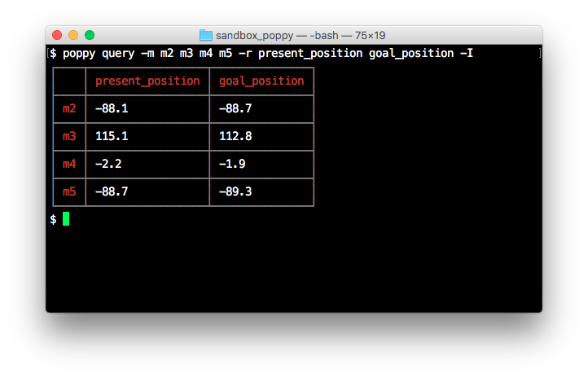
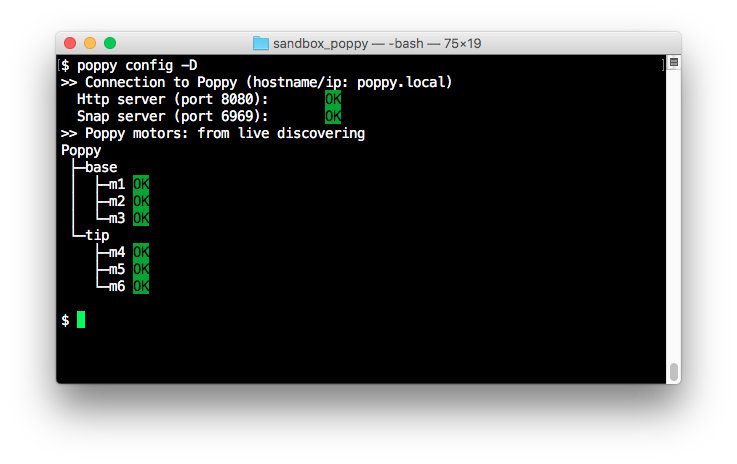

# Poppy Robot CLI

[![NPM version][npm-image]][npm-url]
[![JavaScript Style Guide][standard-image]][standard-url]
[![Dependency Status][david-image]][david-url]
[![devDependency Status][david-dev-image]][david-dev-url]

This module add CLI features to the [poppy-robot-core][core-link] one and then, it allows to simply drive and querying state of any robot of the [Poppy project](https://www.poppy-project.org/en/) family.

It provides:

- A standalone [CLI mode](#cli-mode) to query and send basic set of instructions to the motor registries and then, to allow performing unary 'action' on motors such as move, speed settings, simply typing in a command line terminal.

    As example:

    ```shell
    poppy exec rotate 30 -m m1 m2
    ```

    will rotate by 30 degrees the motors m1 and m2.

    Typing:

    ```shell
    poppy query
    ```

    will return data about all registers 'of interest' for all motors.

    

- A "wrapper" of the exposed [poppy-robot-core](https://github.com/nbarikipoulos/poppy-robot-core) factories in order to both manage a set of common flags dedicated to the connections with Poppy.

    As example:

    ```shell
    poppy exec rotate 30 -m m1 m2 --ip 'poppy1.local' -p 8081
    ```

    will address this rotate command to a Poppy with ip/hostname and port of its REST api set to respectively
    'poppy1.local' and 8081. Note these additionnal flags can be used with poppy script (cf. [script](https://github.com/nbarikipoulos/poppy-robot-core#scripts) in [poppy-robot-core](https://github.com/nbarikipoulos/poppy-robot-core) module):

    ```shell
    node myScript.js --ip 'poppy1.local' -p 8081
    ```

- Next to these common flags, a poppy rc file feature that allows persisting of these connection parameters into a dedicated file.

Enjoy, ;)

## Table of Contents

<!-- toc -->

- [TL;DR](#tldr)
- [Getting Started](#getting-started)
  * [Installing node.js](#installing-nodejs)
  * [Installing the poppy-robot-cli module](#installing-the-poppy-robot-cli-module)
- [Usage](#usage)
- [CLI Mode](#cli-mode)
  * [Querying](#querying)
  * [Executing Single Command](#executing-single-command)
    + [compliant](#compliant)
    + [speed](#speed)
    + [rotate](#rotate)
    + [position](#position)
    + [led](#led)
  * [Rebooting Poppy](#rebooting-poppy)
  * [Configuring Poppy](#configuring-poppy)
    + [Connection Settings](#connection-settings)
  * [Poppy "Run Commands" File](#poppy-run-commands-file)
- [Check and Display Configuration](#check-and-display-configuration)
  * [Advanced use](#advanced-use)
- [Common CLI Flags](#common-cli-flags)
- [API](#api)
- [Credits](#credits)
- [License](#license)

<!-- tocstop -->

## TL;DR

You just have to install this node module on your local computer, to turn on your Poppy (Ergo Jr, if not read [this](#discovering-robot-configuration)) and enjoy.

The next line will globally install the module on your computer (more details are available [here](#getting-started)):

```shell
npm install poppy-robot-cli -g
```

Then type:

```shell
poppy -h
```

To access to the inline help provided with the cli which allows both querying and sending simple command to the motors of the robot.

Note, once the Poppy switches on and ready (green light blinking), the __config__ command must be performed first.

## Getting Started

### Installing node.js

the poppy-robot-cli is intented to be used under a node.js 'environment' on your local computer. Thus it should be first installed (sic):

- Downloading it from its [official site](https://nodejs.org/en/download/),
- Or using a node version manager such as nvm (macos/linux version or Windows one are respectively available [here](https://github.com/creationix/nvm) and [there](https://github.com/coreybutler/nvm-windows)).

Note a node.js release equal or higher to v12.0.0 is required.

### Installing the poppy-robot-cli module

Once [node.js](https://nodejs.org/en/download/) installed, type:

```shell
npm i poppy-robot-cli --global
```

that will globally install the poppy-robot-cli module.

To verify that it has been successfully installed, type:

```shell
npm list -g -depth=0
├── npm@6.13.4
├── poppy-robot-cli@5.1.0
└── poppy-robot-core@6.0.0
```

Then, simply type:

```shell
poppy -h
```

will display the basic help about the poppy-robot-cli.

## Usage

Once installed, both CLI mode and scripting mode are addressable without any other settings.

__Note a specific command must be performed at each Poppy switching on in order to properly initialize the embedded http server in Poppy.__

Next the Poppy robot turns on and is ready (green light blinking), the following command should be performed first:

```shell
poppy config
```

If not performed, the first command/request send to the Poppy next to switching it on will systematically failed, next ones will succeed.

Furthermore, Note for particular/advanced cases, users can configure some Poppy parameters such as connection settings, and so on as explained in a dedicated [section](#configuring-poppy).

## CLI Mode

The cli commands are divided into 4 parts:

- A querying module to get information about the motors,
- A command module which allows sending simple commands to the motors,
- A poppy rebooting command,
- At last, a module dedicated to manage poppy configuration.

### Querying

First group of cli commands allows querying the register of the motors of the robot.

Typing:

```shell
poppy query
```

will return data about all registers 'of interest' for all motors.


Adding the flag -h will display help for optional options:

- -m to select the motor(s) to query,
- -r to select the register(s) to query,
- -I to invert the output table form register/motor to motor/register.

As example the following line will only display the registry values for 'present_position' and 'goal_position' of the motors m2 to m5:

```shell
poppy query -m m2 m3 m4 m5 -r present_position goal_position -I
```



### Executing Single Command

Next group of cli commands allows executing a single command to targeted motors. It groups a bunch of commands whose helps are accessible through this command:

```shell
poppy exec <command> -h
```

where the &lt;command&gt; are listed in the table below:

name | description
--- | ---
[compliant](#compliant) | modify the 'compliant' state of motor(s)
[speed](#speed) | set the speed of target motor(s)
[rotate](#rotate) | rotate the selected motor(s) by x degrees
[position](#position) | move the selected motor(s) to a given position.
[led](#led) | set the led color of selected motor(s)

Note **all these commands have a common optional flag '-m' in order to select the target motors**.
**If not set, a command will be applied to all motors** ('m1' to 'm6 for the Poppy Ergo Jr.)

As examples:

```shell
poppy exec led green
```

will set the led color to green of all motors.

```shell
poppy exec led blue -m m1 m2
````

will set the led color of motor m1 and m2 to blue.

Next paragraphs will detail all the available execution commands and their specific options.

#### compliant

```shell
poppy exec compliant [value]
```

This command sets the compliant state of the selected motor(s).

&nbsp; | desc | value | default | mandatory
--- | --- | --- | --- | ---
value| set the 'compliant' register | on \| off | on | no

Examples:

- Set all motors compliant state to 'true' _i.e._ motors are handly drivable:

    ```shell
    poppy exec compliant
    ```

- Same as previous example, but longer...:

    ```shell
    poppy exec compliant on
    ```

- Set all motors compliant state to 'false' _i.e._ motors are programmatically drivable:

    ```shell
    poppy exec compliant off
    ```

#### speed

```shell
poppy exec speed <value>
```

This command sets the the rotation speed of the selected motor(s).

&nbsp; | desc | value | default | mandatory
--- | --- | --- | --- | ---
value | set the 'goal_speed' register | an integer in the [0, 1023] range | n.a. | yes

Examples:

- Set the rotation speed of all motors to 100 (slower):

    ```shell
    poppy exec speed 100
    ```

- Set the rotation speed of the motors m1 and m2 to 500 (quicker):

    ```shell
    poppy exec speed 500 -m m1 m2
    ```

#### rotate

```shell
poppy exec rotate <value> [-w]
```

This command rotates the target motor(s) by x degrees from the current position.

&nbsp; | desc | value | default | mandatory
--- | --- | --- | --- | ---
value | the rotation value (in degree) | integer | n.a. | yes

option | desc | value | default | mandatory
--- | --- | --- | --- | ---
-w | wait until the rotation will finish | boolean | false | no

Examples:

- Rotate the motors m1 and m2 by -30 degrees and wait until each motors will reach its new position:

    ```shell
    cli exec rotate -30 -m m1 m2 -w
    ```

#### position

```shell
cli exec positon <value> [-w]
```

This command sets the target position of the selected motor(s) _i.e._ it will move motor(s) to a given position.

&nbsp; | desc | value | default | mandatory
--- | --- | --- | --- | ---
value | the target position to reach (in degree)| integer | n.a. | yes

option | desc | value | default | mandatory
--- | --- | --- | --- | ---
-w | wait until the motor(s) will reach this new positions  | boolean | false | no

Examples:

- Simultaneously move all motors to the position 0 degree:

    ```shell
    poppy exec position 0
    ```

- Sequentially move all motors to the position 0 degree:

    ```shell
    poppy exec position 0 -w
    ```

- Sequentially move the motors m1 and m2 to the 0 degree position:

    ```shell
    poppy exec position 90 -m m1 m2 -w
    ```

#### led

```shell
poppy exec led [value]
```

This command sets the led color of the selected motor(s).

&nbsp; | desc | value | default | mandatory
--- | --- | --- | --- | ---
value | set the 'led' register| off \| red \| green \| blue \| yellow \| cyan \| pink \| white | off | no

Examples:

- Turn off the led of all motors:

    ```shell
    poppy exec led
    ```

- Set the led color of motor 'm3' to 'green':

    ```shell
    poppy exec led green -m m3
    ```

### Rebooting Poppy

The next command perform a rebooting the robot.

 ```shell
    poppy reboot
```

### Configuring Poppy

#### Connection Settings

In order to configure the connection to the Poppy robot, the poppy-robot-cli automatically appends a bunch of optional flags which are available for both CLI mode or script execution
(_cf._ [Scripting poppy][core-link-script] in [poppy-robot-core][core-link] module):

option | desc | value | default
--- | --- | --- | --- |
-i/--ip | Set the Poppy IP/hostname | string | poppy.local
-p/--http-port | Set the http server port on Poppy | integer | 8080
-P/--snap-port | Set the snap server port on Poppy | integer | 6969

For the CLI mode, such options are available as other ones and typing -h will display them in help.

As example,

```shell
cli exec rotate 30 -m m1 m2 --ip 'poppy1.local' -p 8081
```

will send this rotate by 30 degrees order to a Poppy with an ip/hostname and rest api port respectively set to 'poppy1.local' and 8081.

For script exectution , simply typing -h will display help about these options and simply adding these flags at execution time will configure the Poppy context.

As example,

```shell
node myScript.js --ip poppy1.local -p 8081
```

will execute myScript looking for a Poppy with 'poppy1.local' as hostname and with an http server configured on port 8081.

### Poppy "Run Commands" File

To avoid typing the connection settings values every time, users can persist them in a rc like file through the 'config' command of the CLI.
Typing:

```shell
poppy config --ip poppy1.local -p 8081 --save
```

will create a local .poppyrc file which handles these settings. __This file will be used for each call of the poppy-robot-cli__ (in both CLI or script execution mode) __executed from this directory__.

Note the poppy-robot-cli will:

- First checks if a .poppyrc file exists, and then it will extract its settings,
- On a second hand, use the CLI settings, if any, and then it will override the corresponding values,
- At last, it will override these settings with values passed through the
command line.

## Check and Display Configuration

Additional tasks named allows:
- Checking the connection settings,
- Displaying the robot structure (_i.e._ aliases and motors) and then perform a connection test to all motors,

Typing

```shell
poppy config -M
```

will discover the robot here located with the default values for hostname and http port _i.e._ poppy.local and 8080 and display an aliases/motors tree as shown on the screenshot below:



### Advanced use

Adding -S flag will save this configuration to a descriptor file:

```shell
poppy config -MS myPoppy.json
```

which could be use instead of live discovering:

- Via the poppyrc file:

  - Modifying/creating a .poppyrc file:

      ```js
      {
          "descriptor": "file://myPoppy.json"
      }
      ```

  - Or adding the -s flag over the discovering step to automatically add this line to the .poppyrc file

      ```shell
      poppy config -MS myPoppy.json -s
      ```

- Programmatically through the Poppy object factory (see [API](#API)).

## Common CLI Flags

The poppy-robot-cli module appends a set of common flags to both CLI mode or script execution in order to setup the connection to poppy:

option | desc | value | default
--- | --- | --- | --- |
-i/--ip | Set the Poppy IP/hostname | string | poppy.local
-p/--http-port | Set the http server port on Poppy | integer | 8080
-P/--snap-port | Set the snap server port on Poppy | integer | 6969
-h/--help| Display help | n.a. | n.a.

_n.b._: The snap port is only used to set the led color on dynamixel xl-320 due to an
issue in the pypot library.

Then using this module instead of the poppy-robot-core one, users can type:

```shell
node myScript.js --ip 'poppy1.local' -p 8081
```

## API

This module re-exports the [poppy-robot-core][core-link] module elements. See this module [api][core-link-api] for further details.

## Credits

- Nicolas Barriquand ([nbarikipoulos](https://github.com/nbarikipoulos))

## License

The poppy-robot-cli is MIT licensed. See [LICENSE](./LICENSE.md).

[core-link]: https://github.com/nbarikipoulos/poppy-robot-core#readme
[core-link-api]: https://github.com/nbarikipoulos/poppy-robot-core/blob/master/doc/api.md
[core-link-script]: https://github.com/nbarikipoulos/poppy-robot-core#writing-scripts

[npm-url]: https://www.npmjs.com/package/poppy-robot-cli
[npm-image]: https://img.shields.io/npm/v/poppy-robot-cli.svg
[standard-url]: https://standardjs.com
[standard-image]: https://img.shields.io/badge/code_style-standard-brightgreen.svg

[david-image]: https://img.shields.io/david/nbarikipoulos/poppy-robot-cli.svg
[david-url]: https://david-dm.org/nbarikipoulos/poppy-robot-cli
[david-dev-image]: https://img.shields.io/david/dev/nbarikipoulos/poppy-robot-cli.svg
[david-dev-url]: https://david-dm.org/nbarikipoulos/poppy-robot-cli?type=dev